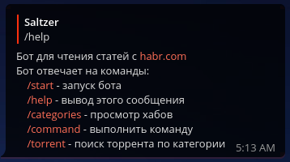
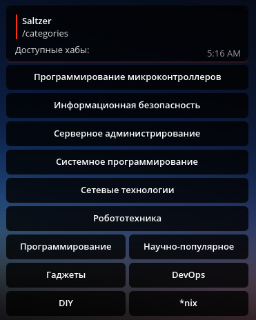
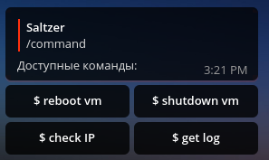

# HabrBot

## About
Bot for parsing articles from habr.com

## Commands
### `/start` - start a Bot

### `/help` - display all available commands

### `/categories` - display hubs

### `/command` - display available VM commands

## To Do

- [x] Log user actions
- [x] Exclude other users via `chat_id`
- [ ] Add updime vm trigger 
