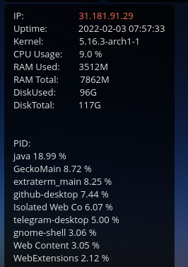

# HabrBot

## About
Bot for parsing articles from habr.com, send commands to host virtual machine and movie database search

Before running the bot, you need to collect the database using 'films_collector.py'

## Commands
### `/start` - start a Bot

### `/help` - display all available commands

### `/categories` - display hubs

### `/command` - display available VM and bot commands

### `$ get info` - display system info

### example log file

### movie search example

## To Do

- [x] Log user actions
- [x] Exclude other users via `chat_id`
- [x] Add check VM sysinfo
- [x] Add restart \ kill bot
- [x] Sqlite3 for parsing films
- [x] Bot and DB collaboration
- [x] Movie Search Exceptions
- [x] Add logging category /films
- [ ] 'Connection reset by peer' error exception (proxy, timeout, enumeration)
