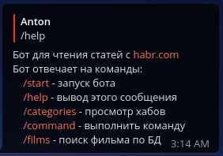

# HabrBot

## About
Bot for parsing articles from habr.com and send commands to virtual machine

## Commands
### `/start` - start a Bot

### `/help` - display all available commands

### `/categories` - display hubs

### `/command` - display available VM and bot commands

### `$ get info` - display system info

### example log file

## To Do

- [x] Log user actions
- [x] Exclude other users via `chat_id`
- [x] Add check VM sysinfo
- [x] Add restart \ kill bot
- [ ] Add torrent downloader
